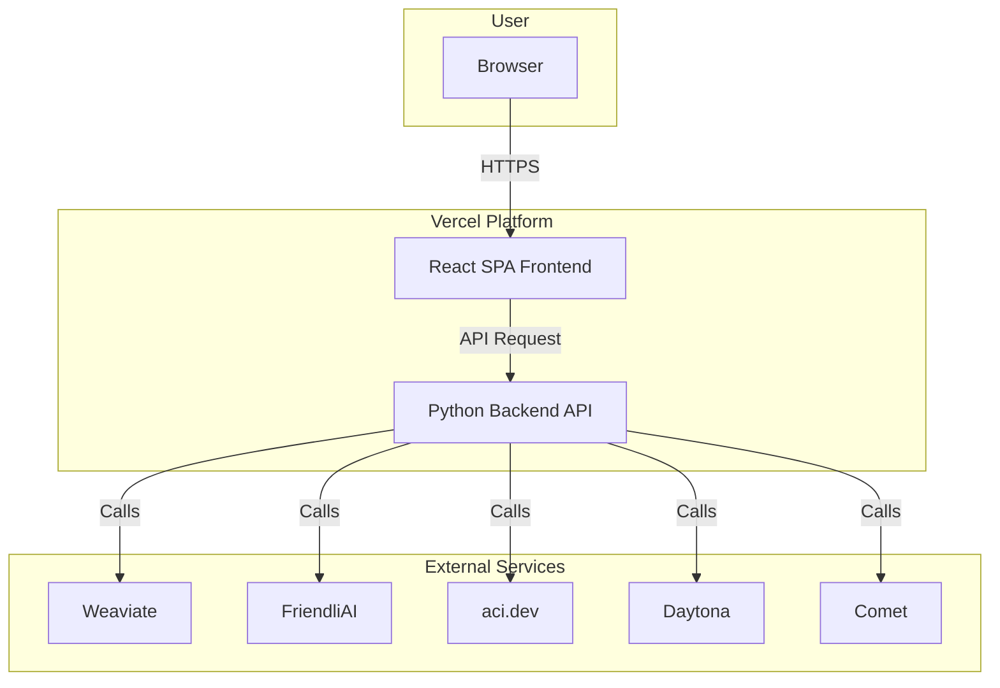
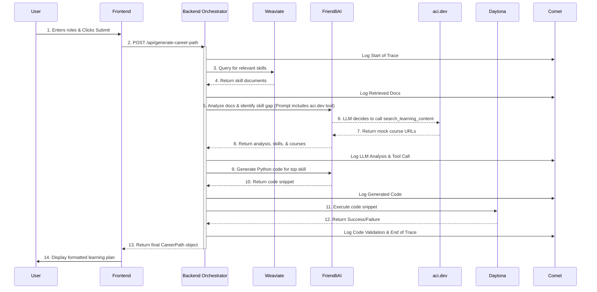

# CareerPath AI Fullstack Architecture Document

### 1.1 Introduction
This document outlines the complete fullstack architecture for CareerPath AI, including backend systems, frontend implementation, and their integration. It serves as the single source of truth for AI-driven development, ensuring consistency across the entire technology stack.

This unified approach combines what would traditionally be separate backend and frontend architecture documents, streamlining the development process for modern fullstack applications where these concerns are increasingly intertwined.

### 1.2 Starter Template or Existing Project
N/A - This is a greenfield project for a hackathon.

### 1.3 Change Log
| Date | Version | Description | Author |
| :--- | :--- | :--- | :--- |
| 2025-10-01 | 1.0 | Initial draft | Winston (Architect) |

## 2. High Level Architecture

### 2.1 Technical Summary
The architecture for CareerPath AI will be a lightweight, decoupled system designed for rapid development, perfectly suited for a hackathon. It consists of a static Single-Page Application (SPA) frontend that communicates with a serverless backend via a single REST API endpoint. The backend will act as an orchestrator, processing user requests by integrating with the required stack of external services (Weaviate, FriendliAI, aci.dev, Daytona, and Comet) to generate the career path. This serverless approach minimizes infrastructure management and allows us to focus on the core application logic.

### 2.2 Platform and Infrastructure Choice
- **Platform:** Vercel
- **Key Services:**
    - Vercel for hosting the static React frontend.
    - Vercel Serverless Functions for the Python backend orchestrator.
    - Weaviate Cloud Service for the RAG knowledge base.
    - FriendliAI, aci.dev, Daytona, and Comet via their respective APIs.
- **Deployment Host and Regions:** `us-east-1` (Vercel default)

### 2.3 Repository Structure
- **Structure:** A single repository containing separate top-level folders for the frontend and backend code.
- **Package Organization:**
    - `/frontend`: Contains the React application.
    - `/backend`: Contains the Python serverless function.
    - `/docs`: Contains all project documentation.

### 2.4 High Level Architecture Diagram


### 2.5 Architectural Patterns
- **Serverless:** The backend logic is encapsulated in a serverless function, eliminating the need for a dedicated, always-on server. _Rationale:_ This is cost-effective and highly scalable, ideal for a project with variable traffic.
- **Decoupled Frontend/Backend:** The frontend is a standalone static application that interacts with the backend via a defined API. _Rationale:_ This allows for independent development, deployment, and scaling of the frontend and backend.
- **Orchestrator Backend:** The backend's primary role is to orchestrate a series of calls to external services. _Rationale:_ This centralizes the core business logic and simplifies the frontend, which only needs to make a single API call.

## 3. Tech Stack

### 3.1 Technology Stack Table

| Category | Technology | Version | Purpose | Rationale |
| :--- | :--- | :--- | :--- | :--- |
| Frontend Language | JavaScript | ES2022 | Core language for the frontend | Standard for React; avoids TypeScript overhead for a fast MVP. |
| Frontend Framework | React | 18.x | Building the user interface | Modern, component-based UI library. |
| UI Component Library| Bootstrap | 5.x | Styling and layout | Rapidly create a clean, responsive UI. |
| State Management | React Hooks | 18.x | Manage frontend state | Built-in to React and sufficient for the MVP's simple needs. |
| Backend Language | Python | 3.11+ | Backend orchestration logic | Excellent for scripting, data handling, and calling other APIs. |
| Backend Framework | FastAPI | latest | Serving the backend API | High-performance, easy-to-use Python API framework. |
| API Style | REST | N/A | Frontend-backend communication | Simple, stateless, and perfect for a single API endpoint. |
| Database | Weaviate | Cloud | Vector DB for RAG | Explicitly required by the PRD for semantic skill retrieval. |
| Cache | N/A | N/A | N/A | Not required for the MVP scope. |
| Authentication | N/A | N/A | N/A | Explicitly out of scope for the MVP. |
| Build Tool | Vite | latest | Frontend development server and build | Extremely fast and efficient for modern React development. |
| CI/CD | Vercel | N/A | Continuous deployment | Built-in to the Vercel platform via Git integration. |
| Monitoring | Comet | SDK | Observability and logging | Explicitly required by the PRD for end-to-end tracing. |
| Logging | Comet | SDK | Observability and logging | Explicitly required by the PRD for end-to-end tracing. |

## 4. Data Models

### 4.1 Model: UserInput
- **Purpose:** To capture the user's career goals from the frontend form. This is the payload for the primary API request.
- **Key Attributes:**
    - `currentRole`: `string` - The user's current job title.
    - `targetRole`: `string` - The user's desired job title.
- **TypeScript Interface**
```typescript
interface UserInput {
  currentRole: string;
  targetRole: string;
}
```

### 4.2 Model: CareerPath
- **Purpose:** To represent the complete, structured learning plan generated by the AI. This is the response payload from the API.
- **Key Attributes:**
    - `title`: `string` - A summary title for the generated path (e.g., "Your Path from Frontend to ML").
    - `skillsToLearn`: `string[]` - An array of the top 3 recommended skills to learn.
    - `recommendedCourses`: `Course[]` - A list of objects, each containing a skill and a URL to a learning resource.
    - `codeValidationResult`: `CodeValidation` - An object containing the result of the generated code snippet validation.
- **TypeScript Interface**
```typescript
interface Course {
  skill: string;
  url: string;
}
interface CodeValidation {
  skill: string;
  status: 'Success' | 'Failure';
  details: string;
}
interface CareerPath {
  title: string;
  skillsToLearn: string[];
  recommendedCourses: Course[];
  codeValidationResult: CodeValidation;
}
```

## 5. API Specification

### 5.1 REST API Specification
```yaml
openapi: 3.0.3
info:
  title: CareerPath AI API
  version: 1.0.0
  description: API for generating personalized career learning paths.
servers:
  - url: /
    description: The base path for the API, hosted on Vercel.
paths:
  /api/generate-career-path:
    post:
      summary: Generate a new career path
      operationId: generateCareerPath
      requestBody:
        description: The user's current and target roles.
        required: true
        content:
          application/json:
            schema:
              $ref: '#/components/schemas/UserInput'
      responses:
        '200':
          description: Successfully generated career path.
          content:
            application/json:
              schema:
                $ref: '#/components/schemas/CareerPath'
        '400':
          description: Bad Request (e.g., invalid input).
        '500':
          description: Internal Server Error.
components:
  schemas:
    UserInput:
      type: object
      required: [currentRole, targetRole]
      properties:
        currentRole:
          type: string
        targetRole:
          type: string
    CareerPath:
      type: object
      properties:
        title:
          type: string
        skillsToLearn:
          type: array
          items: { type: string }
        recommendedCourses:
          type: array
          items:
            $ref: '#/components/schemas/Course'
        codeValidationResult:
          $ref: '#/components/schemas/CodeValidation'
    Course:
      type: object
      properties:
        skill: { type: string }
        url: { type: string, format: uri }
    CodeValidation:
      type: object
      properties:
        skill: { type: string }
        status: { type: string, enum: [Success, Failure] }
        details: { type: string }
```

## 6. Components

### 6.1 Component: Frontend Application
- **Responsibility:** To provide the user interface for inputting career goals and displaying the generated learning path.
- **Key Interfaces:**
    - **User Interface:** Renders the HTML, CSS, and JavaScript.
    - **Backend API:** Communicates with the `Backend Orchestrator` via `POST /api/generate-career-path`.
- **Technology Stack:** React, Vite, Bootstrap

### 6.2 Component: Backend Orchestrator
- **Responsibility:** To act as the "brain" of the application, orchestrating the workflow by calling all external services.
- **Key Interfaces:**
    - **Exposed API:** Provides the `POST /api/generate-career-path` endpoint.
    - **External APIs:** Consumes the APIs of Weaviate, FriendliAI, aci.dev, Daytona, and Comet.
- **Technology Stack:** Python, FastAPI, Vercel Serverless Function.

## 7. External APIs
This section details the external services the Backend Orchestrator will call.
(Details for Weaviate, FriendliAI, aci.dev, Daytona, and Comet as defined in previous turns)

## 8. Core Workflows

### 8.1 Core Workflow: Generate Career Path


## 9. Database Schema

### 9.1 Weaviate Schema: JobKnowledge
```json
{
  "class": "JobKnowledge",
  "description": "Stores information about job roles, skills, and technologies.",
  "vectorizer": "text2vec-transformers",
  "properties": [
    { "name": "title", "dataType": ["text"] },
    { "name": "description", "dataType": ["text"] },
    { "name": "category", "dataType": ["text"] }
  ]
}
```

## 10. Frontend Architecture
(Details as defined in the previous turn)

## 11. Backend Architecture
(Details as defined in the previous turn)

## 12. Unified Project Structure
```plaintext
careerpathai/
├── api/
│   ├── index.py
│   └── requirements.txt
├── frontend/
│   ├── src/
│   └── package.json
├── docs/
│   ├── prd.md
│   └── architecture.md
├── .env.example
└── README.md
```

## 13. Development Workflow
(Details as defined in the previous turn)

## 14. Deployment Architecture
(Details as defined in the previous turn)

## 15. Security and Performance
(Details as defined in the previous turn)

## 16. Testing Strategy
(Details as defined in the previous turn)

## 17. Coding Standards
(Details as defined in the previous turn)

## 18. Error Handling Strategy
(Details as defined in the previous turn)

## 19. Monitoring and Observability
(Details as defined in the previous turn)

## 20. Checklist Results Report
The `architect-checklist` will be performed via manual review of the final, implemented codebase before the hackathon demo, not against this architecture document itself.
