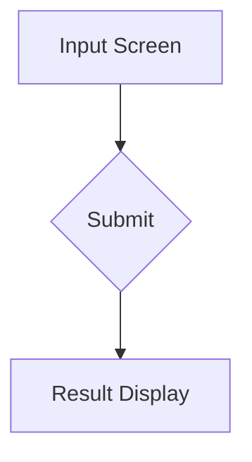
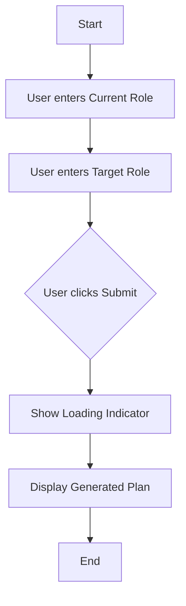

# CareerPath AI UI/UX Specification

This document defines the user experience goals, information architecture, user flows, and visual design specifications for CareerPath AI's user interface. It serves as the foundation for visual design and frontend development, ensuring a cohesive and user-centered experience.

## 1. Overall UX Goals & Principles

### 1.1. Target User Personas
- **The Career Changer:** A software developer who is technically proficient but new to a specific domain (e.g., transitioning from Frontend to ML). They are looking for a clear, direct, and efficient path to acquiring new skills. They value actionable advice over comprehensive but overwhelming options.

### 1.2. Usability Goals
- **Clarity and Focus:** The user can immediately understand what information is required from them.
- **Efficiency:** The user can input their roles and submit the form in under 30 seconds.
- **Actionability:** The output provides clear, direct next steps for the user.

### 1.3. Design Principles
1.  **Simplicity First:** The interface should be minimal and free of distractions.
2.  **Guide, Don't Overwhelm:** Provide a clear path with a limited set of focused results.
3.  **Action-Oriented:** Every element should drive the user towards their goal of getting a learning path.

## 2. Information Architecture (IA)

### 2.1 Site Map / Screen Inventory
For the MVP, the application consists of a single screen.

### 2.2 Navigation Structure
- **Primary Navigation:** Not applicable for the MVP. The entire experience is contained within a single page.
- **Secondary Navigation:** Not applicable for the MVP.
- **Breadcrumb Strategy:** Not applicable for the MVP.

## 3. User Flows

### 3.1 Flow: Generate Career Path
- **User Goal:** To receive a personalized, actionable 3-step learning plan for transitioning from their current role to their target role.
- **Entry Points:** Landing on the main application page.
- **Success Criteria:** The user receives a 3-step plan with course links and a code validation confirmation.

#### 3.1.1 Flow Diagram

#### 3.1.2 Edge Cases & Error Handling:
- **Empty Inputs:** If the user clicks "Submit" with one or both fields empty, display an inline error message prompting them to fill out both roles.
- **Backend Error:** If the system fails to generate a plan, display a friendly error message like, "Sorry, an error occurred. Please try again."
- **No Results Found:** If the AI cannot determine a path, inform the user gracefully: "We couldn't find a clear path for this transition. Please try different or more specific roles."

## 4. Wireframes & Mockups

This specification will serve as the blueprint for the UI.

### 4.1 Key Screen Layouts

#### 4.1.1 Screen: Career Path Generator
- **Purpose:** To capture the user's current and target roles to generate a personalized learning path.
- **Key Elements:**
    - **H1 Heading:** "CareerPath AI"
    - **Instructional Text:** "Enter your current role and your target role to generate a personalized learning plan."
    - **Input Field 1:** Label: "Your Current Role", Placeholder: "e.g., Frontend Developer"
    - **Input Field 2:** Label: "Your Target Role", Placeholder: "e.g., Machine Learning Engineer"
    - **Submit Button:** Text: "Generate Path"
    - **Result Container:** An area below the form where the generated plan will be displayed. Initially empty.
    - **Loading Indicator:** A spinner or pulsing animation that appears over the result container after submission.
    - **Error Message Area:** A space to display errors, e.g., above the form.
- **Interaction Notes:**
    - The "Generate Path" button should be disabled until both input fields are filled.
    - Upon clicking "Generate Path", the button is disabled and the loading indicator appears.
    - The results, once received, are rendered in the "Result Container".
    - If an error occurs, it is displayed in the "Error Message Area".

## 5. Component Library / Design System

### 5.1 Design System Approach
For the MVP, a formal design system will not be created. We will use a standard, class-based CSS framework like **Bootstrap**.

### 5.2 Core Components
- **Text Input:** Standard text input fields with clear labels. States: default, focused, disabled, error.
- **Button:** A single primary action button. States: default, hover, disabled.
- **Result Card:** A container with a distinct background or border to visually separate the results.

## 6. Branding & Style Guide

### 6.1 Color Palette
| Color Type | Hex Code  | Usage                               |
| :--- | :--- | :--- |
| Primary    | `#007bff` | Buttons, links, focus indicators    |
| Success    | `#28a745` | Success confirmation messages       |
| Error      | `#dc3545` | Error messages and validation       |
| Neutral    | `#343a40` | Main body text                      |
| Neutral    | `#f8f9fa` | Light page or card backgrounds      |
| Neutral    | `#ced4da` | Borders and dividers                |

### 6.2 Typography
- **Font Families:** `system-ui, -apple-system, "Segoe UI", Roboto, "Helvetica Neue", Arial, sans-serif`.
- **Type Scale:** H1: 2.25rem (semi-bold), Body: 1rem (regular).

## 7. Accessibility Requirements

- **Compliance Target:** Adhere to fundamental accessibility principles.
- **Key Requirements:**
    - **Color Contrast:** Meet a contrast ratio of at least 4.5:1.
    - **Focus Indicators:** All interactive elements must have a visible focus state.
    - **Keyboard Navigation:** The application must be fully operable via keyboard.
    - **Semantic HTML:** Use proper tags like `<label>`, `<h1>`, `<button>`.
- **Testing:** Manual keyboard testing and a quick automated scan.

## 8. Responsiveness Strategy

- **Breakpoints:** Mobile (<768px) and Desktop (>=768px).
- **Layout:** A fluid, single-column layout with a max-width on desktop.

## 9. Animation & Micro-interactions

- **Principles:** Motion will be subtle and purposeful.
- **Key Animations:** A loading spinner during processing, a fade-in for results, and standard transitions for controls.

## 10. Performance Considerations

- **Goals:** Initial page load under 2 seconds.
- **Strategies:** Use a lightweight CSS framework, no custom fonts or images, and keep JavaScript minimal.

## 11. Next Steps

- **Immediate Actions:**
    1. Review this specification with the development team.
    2. Begin front-end development.
    3. Integrate with backend APIs.
- **Handoff Checklist:** All items are considered complete for the MVP scope.
